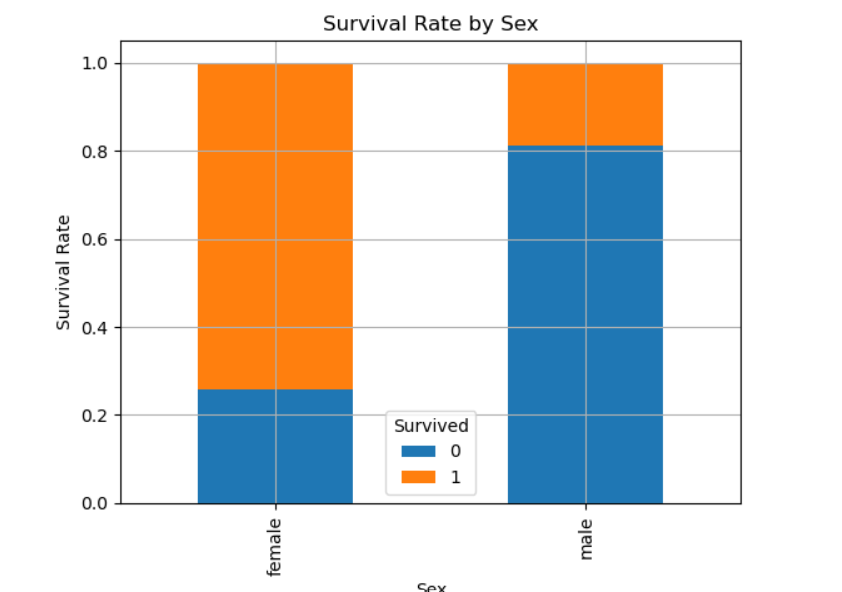
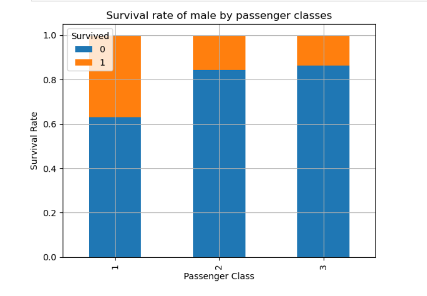
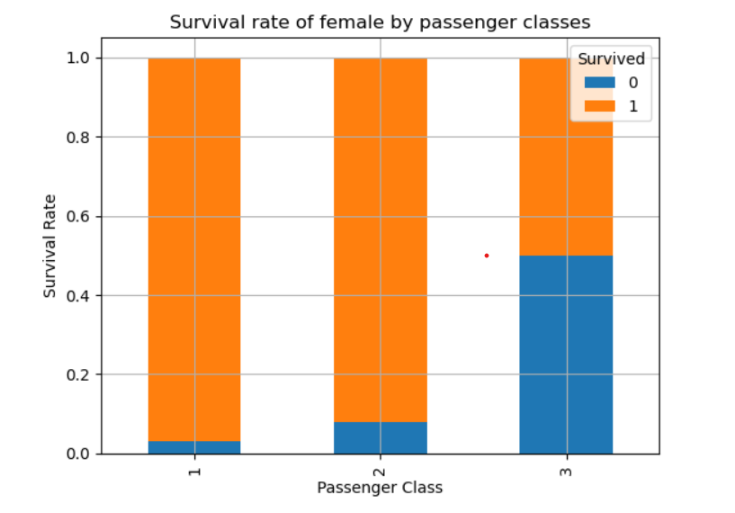
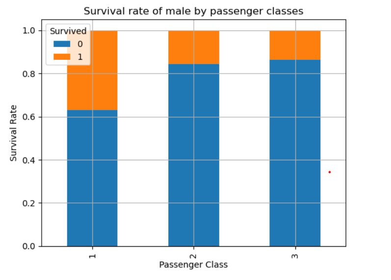

# Titanic Survival Analysis Project

This project analyzes the survival data of passengers aboard the Titanic using Python and various data analysis libraries.

## Introduction

The sinking of the  Titanic is one of the most infamous shipwrecks in history. On April 15, 1912, during her maiden voyage, the Titanic sank after colliding with an iceberg, resulting in the deaths of over 1500 passengers and crew. This project aims to analyze the factors that influenced the survival rates of passengers.

## Screenshots

  
### Survival by Sex

  

### Passenger Distribution by Class

  
### Survival Rates of Women by Class

  
### Survival Rates of Men by Class

  
## Key Insights

- The largest number of passengers were in class 3 followed by class 1 and class 2.
- Majority of passengers were in the age group 15-30 years.
- Passengers in First Class had the highest chance for survival.
- The majority of females survived, whereas the majority of males did not

## Conclusions:
- Passengers in First Class had significantly higher survival rates compared to other classes, indicating a potential correlation between socio-economic status and survival.
- Gender played a significant role in survival, with females having a much higher survival rate than males.
- Age distribution shows that the majority of passengers were young adults, possibly indicating priority given to women and children during the evacuation process.
